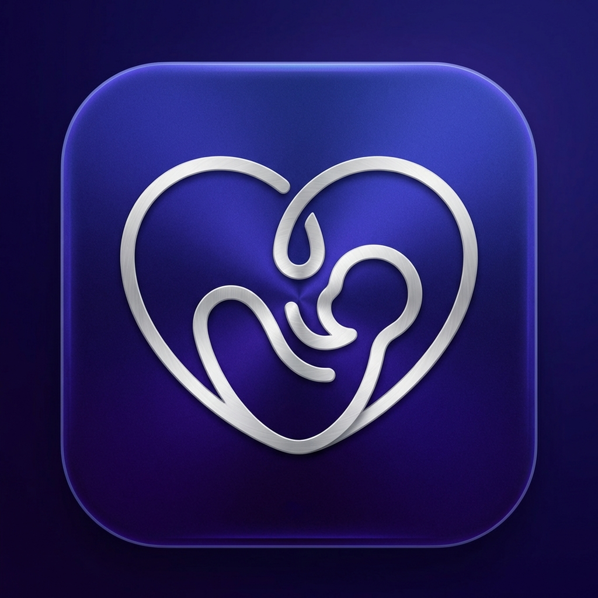
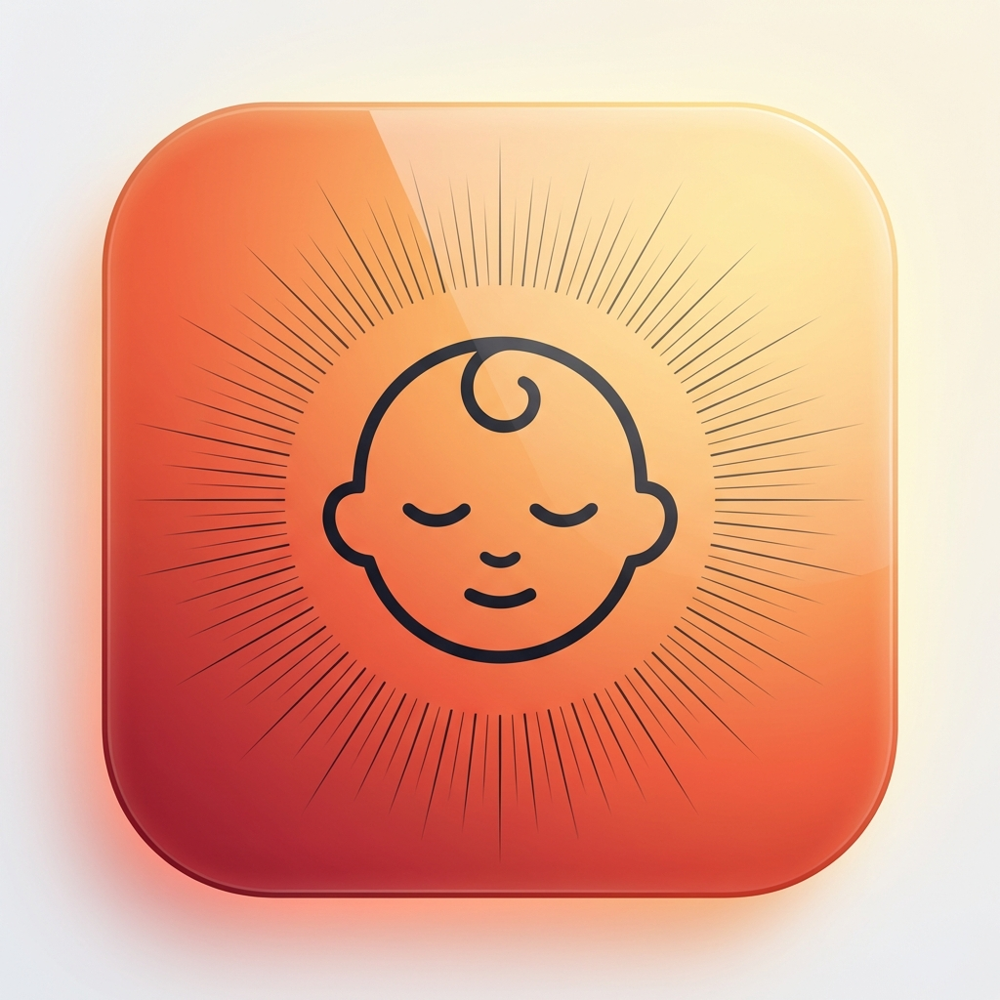
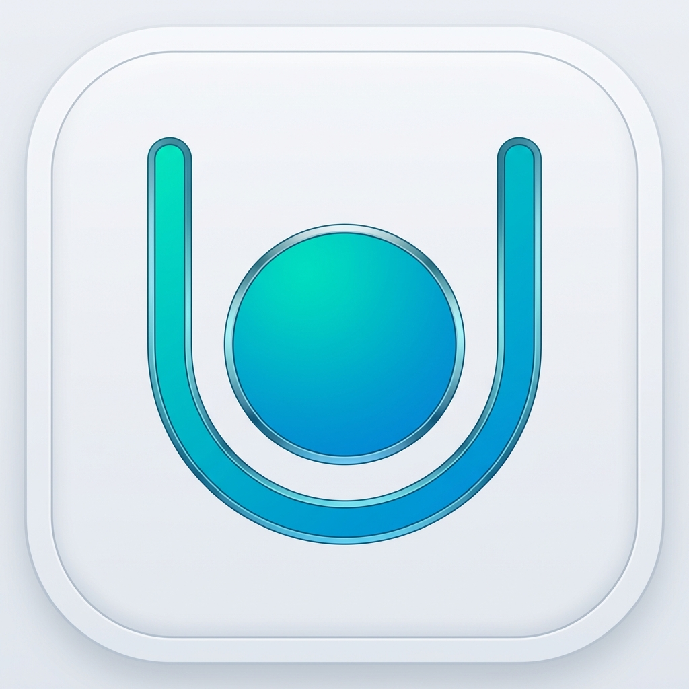

# The Final Trio: World-Class Minimalism

These three concepts represent the "Top 1%" of global app design. No text, perfect line balance, and high-end aesthetics inspired by award-winning apps.

````carousel

## Concept 15: The Infinite Embrace
**Style:** World-Class Line Art / Brushed Silver
**Why it works:**
- **The Symbol:** A single continuous silver line forming an infinite bond between parent and child.
- **Premium Material:** The brushed metal texture on a deep indigo gradient feels heavy, expensive, and modern.
- **Confidence:** No text needed. The symbol is strong enough to stand on its own globally.

<!-- slide -->

## Concept 16: The Celestial Ray
**Style:** Modern Zen / Sunrise Gradient
**Why it works:**
- **Warmth:** The "Sunrise" background signals a new day, hope, and care. 
- **Iconic Face:** A distilled, line-art baby face that is instantly cute and recognizable in under 0.1 seconds.
- **Detail:** Thin, tapered rays add a sense of precision and intentionality (Apple-style).

<!-- slide -->

## Concept 17: The Modern Cradle
**Style:** Bauhaus / Architectural Minimalism
**Why it works:**
- **Simplicity:** A single cradle stroke holding the 'perfect circle' of the baby.
- **Freshness:** Crisp white background with a vibrant Teal-to-Azure line makes it pop on any wallpaper.
- **Status:** Looks like an app that ships pre-installed on an iPhone. Pure class.
````

### Final Choice
For **CalmParentApp**, these three are the strongest candidates. 
- **Infinite Embrace** for a "Premium Tech & Trust" feeling.
- **Celestial Ray** for a "Warm, Friendly" feeling.
- **Modern Cradle** for a "Clean, Medical, Simple" feeling.
